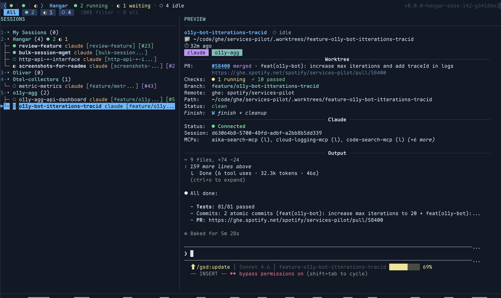
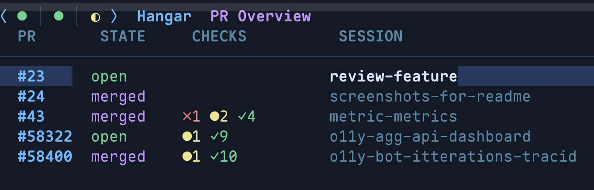
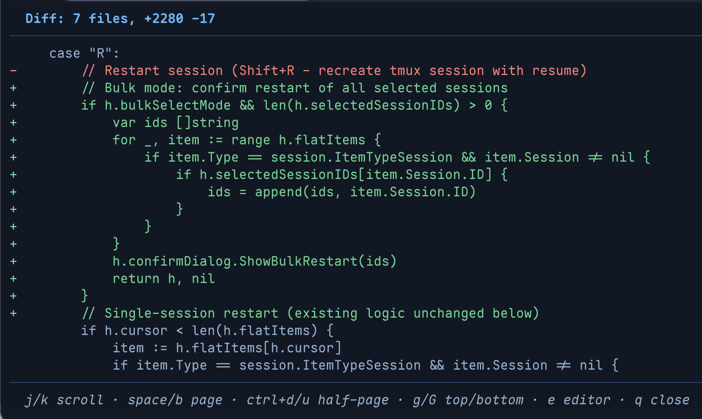
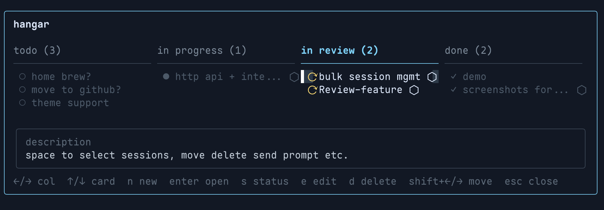
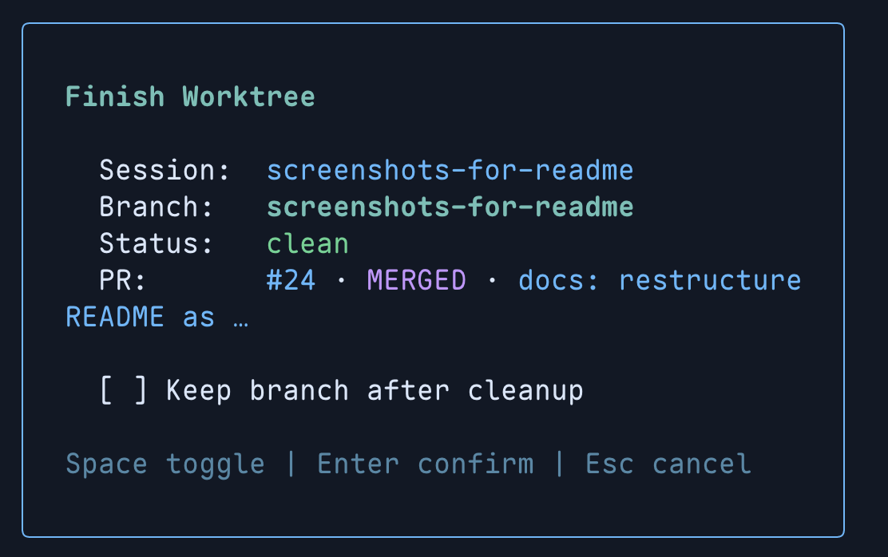

# Hangar

**A terminal session manager for Claude Code — built for engineers who live in git worktrees.**

> **Hangar is a highly opinionated personal fork of [agent-deck](https://github.com/asheshgoplani/agent-deck).** It strips away multi-agent orchestration, web UI, Telegram/Slack bridges, and non-Claude tool support to focus on a single use case: one engineer, Claude Code, and a lot of git worktrees. If you need the full feature set, check out agent-deck instead.

---

## Features

### Live Session Monitoring

Every Claude session shows real-time status — running `●`, waiting `◐`, or idle `○` — updated instantly via Claude Code lifecycle hooks.



### PR Badges & Overview

Worktree sessions with open PRs display color-coded badges in the sidebar (green = open, purple = merged). Press **`P`** for a full-screen PR dashboard with CI check status.



### Inline Diff View

Press **`D`** to open a pager-style diff overlay for any session's working directory — scroll, page, and jump to hunks without leaving Hangar.



### Todo Kanban Board

Press **`t`** to open a per-project kanban board with todo → in progress → in review → done columns. Press `Enter` on a card to spin up a new Claude session + worktree for that task.



### Worktree-First Workflow

Every new session automatically creates a git worktree from the latest base branch. Press **`W`** to merge, clean up, and close in one step.



### Send Text Without Attaching

Press **`x`** to send a message to any session — no attach/detach needed.

---

## Quick Start

**Homebrew (recommended):**

```bash
brew install sjoeboo/tap/hangar
```

**curl installer:**

```bash
curl -fsSL https://github.com/sjoeboo/hangar/raw/master/install.sh | bash
```

Then get started:

```bash
# Register a project
hangar project add myrepo ~/code/myrepo

# Install Claude Code hooks (enables instant status detection)
hangar hooks install

# Launch
hangar
```

**Requirements:** tmux, git. `gh` CLI optional (PR status, diff view). lazygit optional (`G` key).

> Building from source? See [Installation](docs/installation.md).

---

## Key Bindings

### Sessions

| Key         | Action                          |
| ----------- | ------------------------------- |
| `Enter`     | Attach to session               |
| `n` / `N`   | New session / Quick session     |
| `R`         | Restart session                 |
| `f` / `F`   | Fork session (Claude only)      |
| `x`         | Send text to session            |
| `c`         | Copy output to clipboard        |
| `r`         | Rename session or project       |
| `M`         | Move session to project         |
| `K` / `J`   | Reorder up / down               |
| `d`         | Delete                          |
| `Ctrl+Z`    | Undo delete                     |

### Worktrees & PRs

| Key      | Action                              |
| -------- | ----------------------------------- |
| `W`      | Finish worktree (archive branch)    |
| `v`      | Review PR (open a review session)   |
| `D`      | Inline diff view overlay            |
| `o`      | Open PR in browser                  |
| `P`      | Full-screen PR overview             |

### Navigation & Projects

| Key       | Action                      |
| --------- | --------------------------- |
| `p`       | New project                 |
| `t`       | Todo kanban board           |
| `G`       | Open lazygit                |
| `1`–`9`   | Jump to project by number   |
| `/`       | Search                      |
| `~`       | Toggle status sort          |
| `S`       | Settings                    |
| `Ctrl+R`  | Force-refresh git/PR status |
| `Ctrl+Q`  | Detach from session         |
| `?`       | Full help overlay           |
| `q`       | Quit                        |

---

## Documentation

- [Full Feature Reference](docs/features.md)
- [Configuration](docs/configuration.md)
- [Installation](docs/installation.md)
- [Development](docs/development.md)

---

## License

MIT — see [LICENSE](LICENSE)
